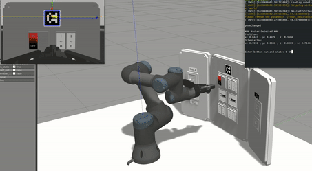
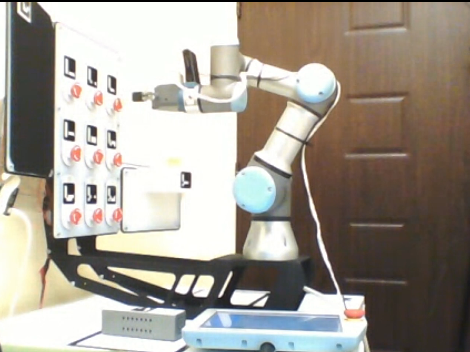

# UR3 Autonomous Maintenance Simulation
A UR3 robotic arm controlled by MoveIt on Gazebo, which simulates an autonomous maintenance task on a panel with buttons, joysticks, lids etc. Competed in the [ERC 2021 Remote Challenge](https://www.roverchallenge.eu) by working on a real UR3 arm and panel.



<br>

### Run Maintenance Demo
Simulator launches Gazebo, MoveIt, aruco_ros, panel and Rviz. 
```bash
roslaunch simulation simulator.launch
```
Semi-autonomous panel maintenance script, detects relative panel location with Aruco markers and pushing given buttons.
```bash
rosrun ur3_move maintenance.py
```

#### Additional

```bash
roslaunch jog_launch ur3.launch use_joy:=true # For joystick control
rosrun image_view image_view image:=/aruco_single/result # View Aruco processed image
```

### Docker
Workspace dockerized to work on real hardware in the challenge. Initial configuration provided by the organization.




-----


#### Packages
- https://github.com/ros-industrial/universal_robot
- https://github.com/tork-a/jog_control
- https://github.com/pal-robotics/aruco_ros
- https://github.com/ros-industrial/robotiq
- https://github.com/ros-controls/ros_control

